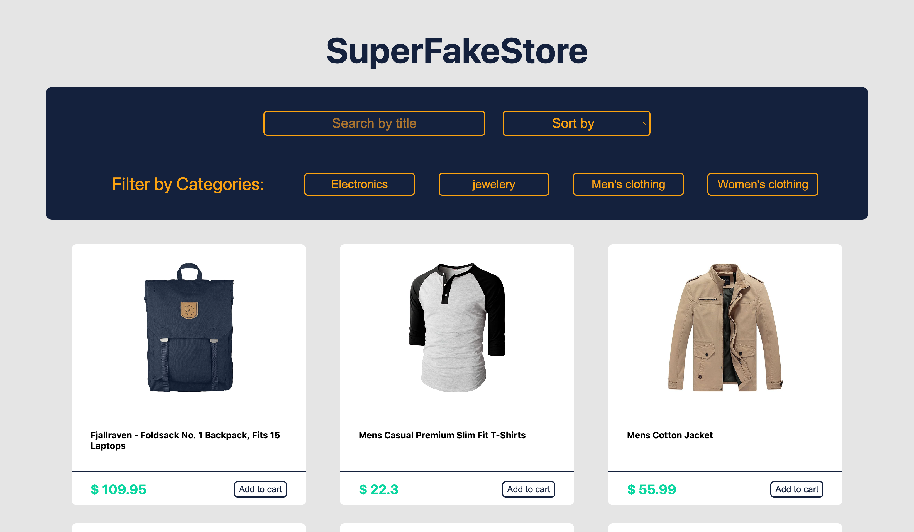

# Project Project Super Fakestore

A practical project for Supercode Fullstack Web-Dev Bootcamp.
in This project the Developer has been given an API with some Products Data and should create an E-Commerce Shop with different features such as search and sort.
The goal of this Project ist to practice APi Fetch Method and use the Sort and Filter Methods for the Given API.

## Demo

You can check the result out in the following video:

https://www.youtube.com/watch?v=4xhOD0hfKZo

## Deployment

To deploy this project click the link below

https://samuelaliyari.github.io/Project-SuperFakeStore/

## Tech Stack

**Client:** HTML, SCSS, Javascript

**Server:** Github Pages

## Authors

- [@Samuel Aliyari](https://github.com/samuelaliyari)

## Screenshots

## Upcoming Features

🚧 Responsive Design 

